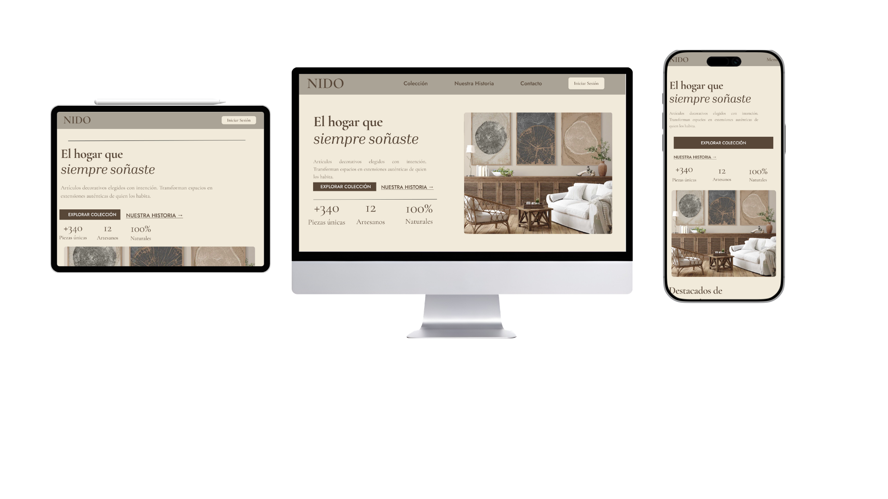
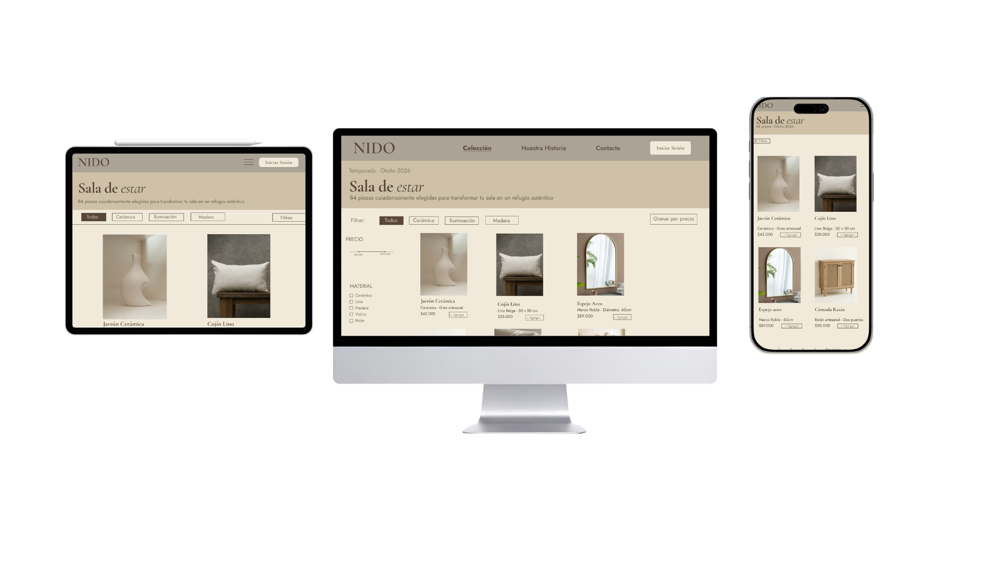
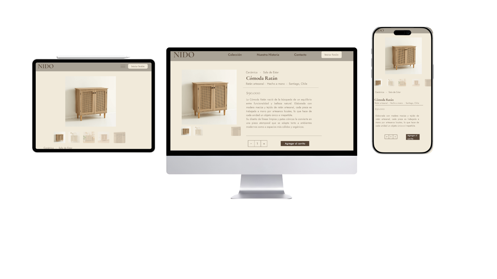

# E0 :construction:

* :pencil2: **Nombre Grupo:** Grupo-3

**Link Deploy:** https://69f3d435ae5bc71f68a00db9--melodic-otter-e318be.netlify.app
## Descripción general :thought_balloon:

- ¿De qué se tratará el proyecto?

Nido es una tienda de e-commerce de artículos decorativos para el hogar. Los usuarios pueden explorar y comprar piezas únicas organizadas por ambiente (sala de estar, dormitorio, entrada, iluminación), gestionar su carrito de compras y hacer seguimiento de sus pedidos. La tienda cuenta además con un panel administrativo para gestionar productos, stock y órdenes.
- ¿Cuál es el fin o la utilidad del proyecto?

El fin de Nido es ofrecer una experiencia de compra en línea elegante e intuitiva para personas que buscan decorar su hogar con productos de calidad. La tienda busca facilitar el acceso a artículos decorativos únicos, permitiendo a los usuarios encontrar fácilmente lo que necesitan según el ambiente que quieren decorar, realizar compras de forma segura y hacer seguimiento de sus pedidos desde una sola plataforma.
- ¿Quiénes son los usuarios objetivo de su aplicación?

Los usuarios objetivo de Nido son personas interesadas en decoración del hogar, que buscan productos de calidad. Se distinguen dos perfiles principales: compradores, que exploran y adquieren productos, y administradores, que gestionan el inventario, los pedidos y el contenido de la tienda.

## Historia de Usuarios :busts_in_silhouette:

1. Como usuario quiero poder registrarme en la plataforma para crear mi propia cuenta y realizar compras.

2. Como usuario quiero poder iniciar sesión directamente desde la landing page para acceder a mi cuenta.

3. Como usuario quiero poder cerrar sesión para proteger mi cuenta cuando termine de usar la página.

4. Como usuario quiero poder ver el catálogo completo con todos los productos para conocer qué productos están disponibles.

5. Como usuario quiero poder ver los precios de los productos en el catálogo para saber cuánto cuesta cada producto.

6. Como usuario quiero poder buscar productos mediante una barra de búsqueda para encontrar lo que necesito.

7. Como usuario quiero poder filtrar productos por tipo, precio, marca y otros criterios para mejorar mis búsquedas.

8. Como usuario quiero poder agregar artículos que quiero comprar a un carrito para juntar mis compras antes de pagar.

9. Como usuario quiero poder eliminar productos de mi carrito para ajustar mis compras antes de finalizar el pedido.

10. Como usuario quiero poder ver mi carrito con todos los producto agregados para revisar mi pedido antes de pagar.

11. Como administrador quiero poder iniciar sesión en el sistema para acceder al panel de administración.

12. Como administrador quiero poder agregar productos al catálogo para ofrecer mas productos disponibles.

13. Como administrador quiero poder editar productos en la página web para actualizar información, precios o descripciones.

14. Como administrador quiero poder modificar el inventario mediante un formulario para mantener actualizada la disponibilidad de productos.

15. Como administrador quiero recibir notificaciones de las ventas realizadas para estar informado sobre los pedidos de clientes.

## Diagrama Entidad-Relación :scroll:
<!-- Insertamos la imagen ER-Model.png -->

## Diseño Web :computer:

<!-- Documento de diseño web -->
### :art: Documento de diseño

<!-- Vistas principales -->
### :mag: Vistas principales
#### Landing page

#### Catálogo

#### Detalle de producto

<!-- Logo -->
### :art: Logo

<!-- ejemplo de aplicacion -->
### :iphone: Ejemplo de aplicación
> [!NOTE]
> Los ejemplos de aplicación deben ser componentes o secciones específicas de su aplicación que reflejen sus decisiones de paleta de colores, tipografía, etc, que se encuentran en su documento de diseño.

