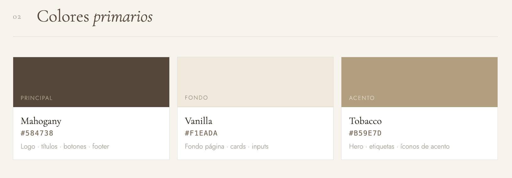
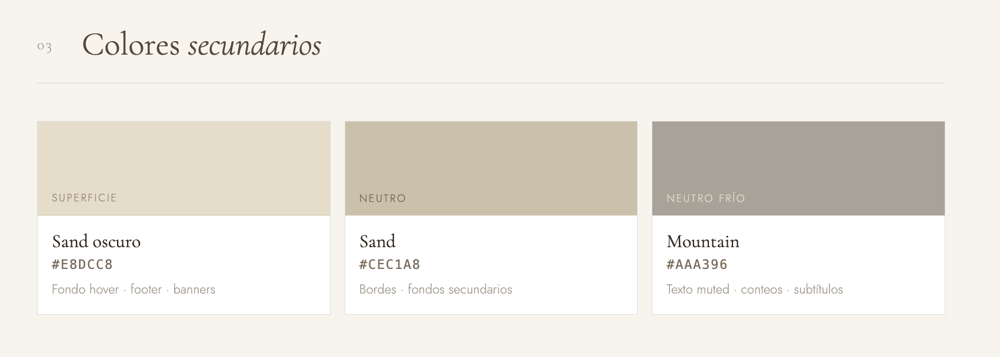
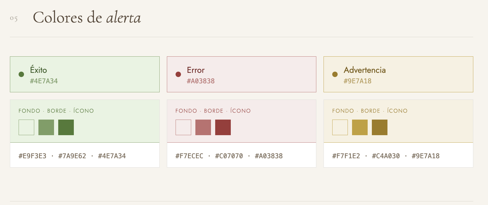
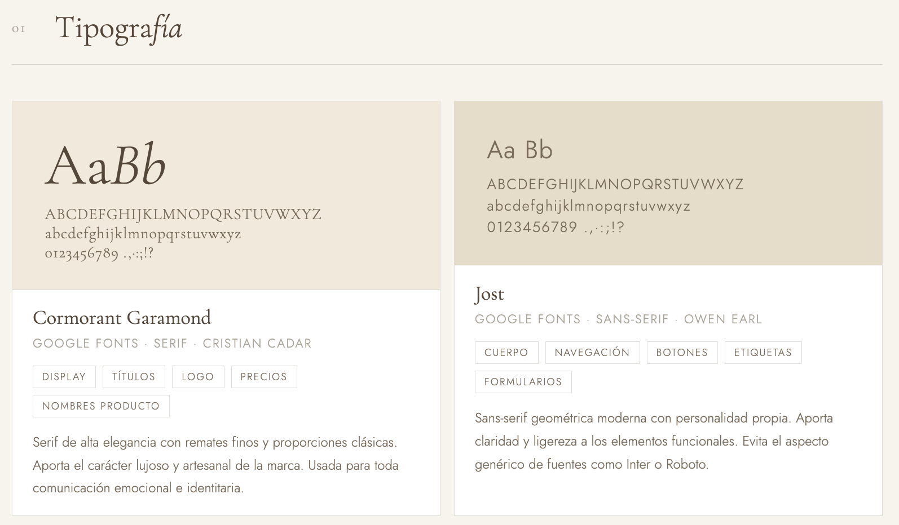
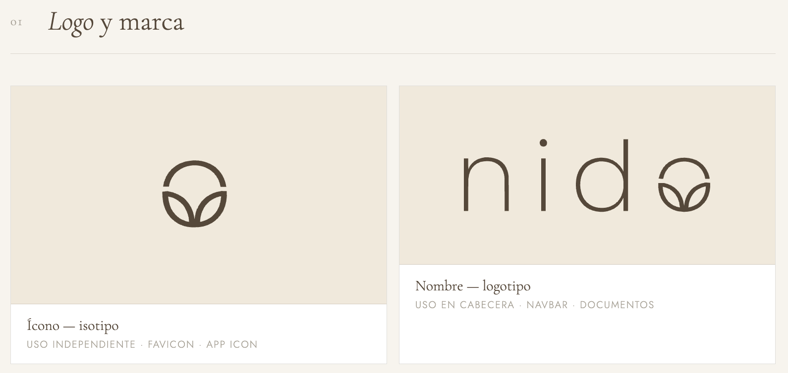

# E0 :construction:

* :pencil2: **Nombre Grupo:** Grupo-3

## Descripción general :thought_balloon:

- ¿De qué se tratará el proyecto?
- ¿Cuál es el fin o la utilidad del proyecto?
- ¿Quiénes son los usuarios objetivo de su aplicación?

## Historia de Usuarios :busts_in_silhouette:

1. Como [rol/usuario] quiero [requerimiento] para [objetivo]
2. ...
3. ...

## Diagrama Entidad-Relación :scroll:
<!-- Insertamos la imagen ER-Model.png -->

## Diseño Web :computer:

<!-- Documento de diseño web -->
### :art: Documento de diseño

<!-- Vistas principales -->
### :mag: Vistas principales

<!-- Logo -->
### :art: Logo

<!-- ejemplo de aplicacion -->
### :iphone: Ejemplo de aplicación
> [!NOTE]
> Los ejemplos de aplicación deben ser componentes o secciones específicas de su aplicación que reflejen sus decisiones de paleta de colores, tipografía, etc, que se encuentran en su documento de diseño.

